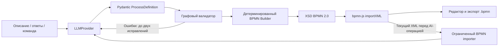

# PULSE — AI Business Process Engineer

Рабочий веб-прототип для полуфинала «ИИ-ассистенты для энергетики». Переводит описание процесса в проверяемую BPMN 2.0 модель, задаёт важные уточнения и позволяет изменять схему обычным языком.

## Возможности

- Текст → строгий Process JSON → программная проверка → BPMN XML с координатами → редактор bpmn-js.
- Внешние участники в отдельных раскрытых пулах, внутренние роли в дорожках организации. Sequence Flow внутри пула, Message Flow между пулами; задачи, условия, XOR, parallel split/join и возвраты.
- До трёх вопросов за итерацию. При критичных неопределённостях схема не публикуется до ответа.
- Ручное редактирование, масштаб, Undo/Redo, импорт `.bpmn`, экспорт текущего полотна.
- Изменение естественным языком; до 20 предыдущих версий в памяти сессии.
- BPMN Doctor: XSD, графовые проверки и бизнес-правила; с реальной моделью также LLM-аудит. Замечания подсвечивают элементы.
- Источник узла и категориальное подтверждение. Категории не являются измеренной вероятностью корректности.
- Предложение TO-BE с перечнем изменений и подтверждением применения. AS-IS доступен в истории.
- Три встроенных примера и честно обозначенный mock-режим без вызовов модели.

## Архитектура



LLM не генерирует XML и не выполняет код. Промпты находятся в `backend/app/prompts`. Сборщик использует lxml, отдельный layout слева направо и стандартные BPMN DI. API-ключи только на backend. Входные описания передаются модели как недоверенные данные. XML parser запрещает DTD и внешние сущности.

Стек: React, TypeScript, Vite, bpmn-js, CSS; Python 3.11+, FastAPI, Pydantic 2, httpx, lxml, pytest. База данных и авторизация для локального MVP не требуются.

## LLM-архитектура

Текущая конфигурация: **MultiAI / `gpt-6.1-sol` → при сбое Vertex Gemini / `gemini-2.5-flash` → ProcessDefinition → Validator → BPMNBuilder**. Бизнес-логика не импортирует SDK и конкретные адаптеры. `MultiAIProvider` использует общий OpenAI-compatible адаптер с валидацией Pydantic; активный адаптер Groq удалён, `VertexGeminiProvider` — официальный `google-genai` (зафиксированная версия 2.28.0), `genai.Client(vertexai=True, api_key=...)`, Vertex Express Google Cloud. Google AI Studio для этого резерва не используется. Endpoint и Express-режим выбирает SDK; дополнительный Google project/location для выбранного режима не требуются. Нужен Google Cloud API key с доступом к Vertex Express. Доступность модели и права ключа проверяются реальным запросом.

```dotenv
# PRIMARY — MULTIAI
PRIMARY_LLM_PROVIDER=multiai
PRIMARY_LLM_BASE_URL=https://multiai.store/v1
PRIMARY_LLM_MODEL=gpt-6.1-sol
PRIMARY_LLM_API_KEY=

# FALLBACK — GOOGLE CLOUD / VERTEX EXPRESS
FALLBACK_LLM_PROVIDER=vertex_gemini
FALLBACK_LLM_MODEL=gemini-2.5-flash
FALLBACK_LLM_API_KEY=

# FAILOVER
LLM_FALLBACK_ENABLED=true
LLM_MAX_RETRIES=2
LLM_TIMEOUT=180
LLM_MAX_TOKENS=8000
```

`PRIMARY_LLM_MODEL`, `PRIMARY_LLM_BASE_URL`, `PRIMARY_LLM_API_KEY` имеют приоритет над прежними `LLM_*`. Прежние настройки совместимых API сохранены. `vertex-gemini` также принимается как алиас `vertex_gemini`. `LLM_FALLBACK_ENABLED=false` выключает резерв. `LLM_MAX_RETRIES` задаёт число corrective retry на одном провайдере: 2 означает первоначальный запрос + до двух исправлений. HTTP 401, 429, timeout, network error, 5xx и временная недоступность модели запускают резерв; ошибки JSON сначала исправляются на том же провайдере. Второй переход и бесконечные retry не выполняются.

Промпты общие в `backend/app/prompts`: extraction, clarification, modification, audit. JSON внутри Markdown или пояснений извлекается внутри адаптера только при наличии одного JSON-объекта; затем обязательна исходная Pydantic-валидация. Vertex получает поддерживаемую проекцию схемы; ограничения исходной модели проверяются после ответа. `LLMRouter` ведёт изолированное состояние одной операции. Metadata возвращает `provider_used`, `model_used`, `fallback_used`, `attempts` (число обращений к AI, включая JSON-исправления и переключение). Верхнее поле `attempts` генерации по-прежнему описывает итерации графового pipeline.

`GET /api/llm/info` не вызывает модели:

```json
{
  "primary": {"provider": "multiai", "model": "gpt-6.1-sol"},
  "fallback": {"enabled": true, "provider": "vertex_gemini", "model": "gemini-2.5-flash"}
}
```

Ключи остаются только в `.env`, файл исключён из Git. Чтобы сменить модель, измените `.env`; существующие API процесса, JSON, экспорт BPMN и bpmn-js не меняются. MultiAI использует тот же проверяемый контракт ProcessDefinition. Резерв Vertex Gemini сохранён. Проверки primary success и failover при 401/429/5xx, timeout и network выполняются для MultiAI и общего совместимого провайдера через mock HTTP/SDK. Реальная проверка сохраняется отдельно в `examples/multiai/verification.json`; автоматические тесты не доказывают доступность внешнего API. Старые результаты Groq ниже и в fixtures относятся к предыдущей конфигурации и сохранены для регрессионной проверки BPMN.

Проверка MultiAI: короткий запрос вернул HTTP 200 за 2,6 секунды. Полная генерация договора заняла около 89 секунд; прежний лимит 90 секунд приводил к timeout. В `.env` и `.env.example` установлен `LLM_TIMEOUT=180`, добавлен `LLM_REASONING_EFFORT=low` (применяется только адаптером MultiAI; пустое значение сохраняет режим API по умолчанию). После двух реальных графовых corrective retry получен BPMN с двумя пулами, шестью участниками и 26 узлами: Pydantic, граф, семантика, OMG XSD и импорт в bpmn-js прошли, fallback не использовался. Суммарное время первичной генерации и исправлений — около 264 секунд: это проверка работоспособности, а не гарантия постоянной скорости API. Результаты и снимок находятся в `examples/multiai/`. 228 backend-тестов прошли; Gemini сохранена как резерв.

## Семантика событий и альтернативных ветвей

PULSE поддерживает Event-Based Gateway, Message Start Event и Intermediate Catch Message Event. В ProcessDefinition это `event_based_gateway`, `event_definition=message` и `decision_basis=data|event|unspecified`. Ожидание будущих альтернативных сообщений отличается от решения по уже полученным данным. Перед валидацией безопасная нормализация уточняет нотацию, сохраняет исходные участники и связи, добавляет XOR merge перед повторным ожиданием и при объединении альтернативных ветвей. Повреждённые ссылки и дубликаты не скрываются.

Validator проверяет один вход и минимум два различных event/receive выхода Event-Based Gateway, отсутствие условий/default, отсутствие смешения Receive Task и Catch Event, отдельный вход каждого ожидания и входящий межпуловый Message Flow у Message Start. Альтернативные ветви не объединяются Parallel Join. Существующие проверки циклов, связности и бизнес-семантики сохранены. Возвратные линии используют отдельные коридоры; размещение подписей учитывает границы узлов и других подписей.

`examples/event-semantics/` содержит детерминированные эталоны с Receive Task и Catch Message Event, BPMN XML и снимки. Они проходят OMG XSD, импорт/экспорт в bpmn-js, повторный импорт в PULSE и импорт в официальный demo.bpmn.io. Проверены оба цикла, стоимость/согласование → XOR merge, стабильность ID, ChangeSet, Modify и Undo. Профиль AI ограничен описательными сообщениями: таймеры, сложная корреляция и messageRef не преобразуются автоматически, чтобы не потерять их смысл.

Последняя проверка: **206 backend + 28 browser = 234 passed**, TypeScript и Vite build прошли. Добавлено 22 backend и 2 browser теста. Реальная генерация сложного процесса после этих изменений пока нестабильна: два запроса закончились HTTP 502 после исчерпания исправлений и резерва из-за некорректного графа модели. Такой результат не публикуется как готовая схема; автоматические тесты не заменяют успешную проверку реальной генерации перед демонстрацией.

## Независимость от LLM

После HTTP 429 LLMRouter запоминает паузу между запросами: учитывает `Retry-After` (секунды или HTTP date), при отсутствии корректного заголовка использует 60 секунд. Пока пауза действует, новые запросы идут в настроенный резерв без обращения к основному API. Без резерва возвращается безопасное сообщение с оставшимся временем ожидания. Резерв также защищён от повторных обращений после своего 429. JSON corrective retry не запускается для ограничения квоты. Ключ, модель и endpoint определяют независимую паузу; ключ хранится только в составе хеша, в журнал выводятся лишь provider, код и время ожидания. Это память одного backend-процесса: после перезапуска она очищается, между несколькими worker-процессами не разделяется. Изменение не увеличивает квоту внешнего провайдера и не гарантирует доступность резервного API.

PULSE использует Adapter / Provider: основные маршруты и BPMN pipeline знают только `LLMProvider`. Конкретные подключения создаёт `get_llm_provider()` в `backend/app/services/llm/factory.py`. HTTP-запросы, авторизация, формат сообщений и обработка внешнего ответа находятся внутри адаптеров. Process JSON не зависит от модели.

Структура AI-слоя:

```text
backend/app/services/llm/
    base.py                       # LLMProvider, LLMMessage, ProviderError
    factory.py                    # выбор провайдера по .env
    openai_provider.py
    openai_compatible_provider.py
    multiai_provider.py            # MultiAI, общий OpenAI-compatible контракт
    gemini_provider.py
    vertex_gemini_provider.py
    yandex_provider.py
    mock_provider.py
    router.py                     # LLMRouter, failover и metadata
```

Все адаптеры возвращают общие Pydantic-модели: `parse_process` → `ProcessDefinition`, `clarify_process` → `ClarificationResult`, `modify_process` → `ModificationResult`, `audit_process` → `AuditResult`. У результатов уточнения и изменения поле `process` содержит `ProcessDefinition`. Существующий внешний контракт API и frontend сохранён.

Чтобы перейти между OpenAI-compatible API (в том числе сервисами с gpt-oss-120b), OpenAI и моделями Яндекса, достаточно изменить в корневом `.env`:

```dotenv
LLM_PROVIDER=openai_compatible
LLM_MODEL=nvidia/nemotron-3-super-120b-a12b:free
LLM_BASE_URL=https://openrouter.ai/api/v1
LLM_API_KEY=ваш_ключ
```

Это пример конфигурации, а не гарантия доступности модели или бесплатных лимитов. Для Яндекса замените эти же четыре значения:

```dotenv
LLM_PROVIDER=yandex
LLM_MODEL=gpt://<folder_ID>/<model_name>
LLM_BASE_URL=https://ai.api.cloud.yandex.net/v1
LLM_API_KEY=секрет_ключа_Яндекса
```

Из полного URI адаптер извлекает ID каталога. При коротком имени модели нужен дополнительный `YANDEX_FOLDER_ID`. Основные `ProcessDefinition`, валидатор, BPMN Builder, Doctor, frontend и существующие endpoints не меняются. Для API с принципиально другим протоколом добавляется адаптер и запись factory, без переработки бизнес-логики.

**Structured Outputs и исправление ответа.** В auto-режиме (параметр `LLM_STRUCTURED_OUTPUT` не задан) совместимые адаптеры пробуют JSON Schema; только при явной ошибке неподдерживаемого формата переходят на JSON mode, затем на JSON по инструкции без `response_format`. `true` принудительно включает JSON Schema, `false` — JSON mode. OpenAI по умолчанию использует строгий JSON Schema. Схема всегда есть в промпте, каждый ответ проходит Pydantic. Некорректный JSON не выходит из адаптера: выполняются до двух corrective retry. Аудит проверяется так же. Затем общий pipeline проверяет граф и при необходимости делает до двух исправлений семантической структуры. Это разные проверки, суммарно они могут потребовать несколько оплачиваемых вызовов. Поддержка JSON не гарантирует сохранения бизнес-смысла.

**Необязательный fallback.** Обычно достаточно `LLM_PROVIDER`. Дополнительно можно задать `PRIMARY_LLM_PROVIDER` (имеет приоритет) и отдельные настройки резерва:

```dotenv
PRIMARY_LLM_PROVIDER=openai_compatible
FALLBACK_LLM_PROVIDER=yandex
FALLBACK_LLM_MODEL=gpt://<folder_ID>/<model_name>
FALLBACK_LLM_BASE_URL=https://ai.api.cloud.yandex.net/v1
FALLBACK_LLM_API_KEY=секрет_резервного_ключа
```

Без `FALLBACK_LLM_PROVIDER` резерв не создаётся. Переход выполняется при timeout, сетевой ошибке, HTTP 429/5xx, временной недоступности модели/API или исчерпании исправлений некорректного JSON. HTTP 401 допускает один переход в настроенный резерв без повторных запросов с неверным ключом. HTTP 403, отказ модели и неправильные настройки не маскируются. Mock не может быть резервом реальной модели. Переключение записывается в серверный журнал без ключей и исходного текста; резерв сохраняется на оставшиеся попытки текущего запроса. Новый запрос снова начинает с primary. Резерв также должен быть настроен и может тарифицироваться.

**Автоматический failover.** `LLMRouter` работает поверх `LLMProvider`. Для каждой HTTP-операции создаётся отдельный router: запрос начинается с primary, резерв сохраняется на оставшиеся попытки этой операции. Невалидный JSON или Pydantic-модель сначала исправляются на том же провайдере (до двух corrective retry); только после исчерпания попыток разрешён резерв. Поддерживаются timeout, network error, HTTP 429, 500/502/503/504 и явные временные ошибки доступности модели/API. HTTP 401 допускает переход в резерв; HTTP 403 и постоянные ошибки настройки не запускают failover. Если оба подключения не дали результат, API возвращает безопасную ошибку 502; текущая диаграмма не заменяется.

В успешных ответах `/api/process/generate`, `/clarify`, `/modify` добавлено поле `metadata`:

```json
{
  "provider_used": "openai_compatible",
  "model_used": "nvidia/nemotron-3-super-120b-a12b:free",
  "fallback_used": false,
  "attempts": 1
}
```

При переключении поля относятся к резервному провайдеру и `fallback_used=true`. Аудит также возвращает metadata при успешном LLM-аудите, иначе null. Ключи, адрес API и исходные ошибки провайдера в metadata не входят. В UI показывается модель последнего AI-ответа или «Резервная модель активирована». `/api/llm/info` по-прежнему сообщает конфигурацию primary, а не результат последней операции. Тесты failover выполняются с подменой HTTP-транспорта; резерв не настроен автоматически без выданных для него реквизитов.

**Обновление настроек.** `.env` читается перед новым AI-запросом без перезапуска сервера. Каждый запрос получает отдельный snapshot подключения, поэтому изменение файла не меняет модель посреди операции. Переменные окружения процесса не используются для этих настроек. API-ключи остаются на сервере, `.env` исключён из Git. `GET /api/llm/info` возвращает конфигурацию primary и fallback без ключей и не обращается к модели.

**Доказательство независимости.** `test_llm_independence.py` проверяет одинаковый `ProcessDefinition` и одинаковый XSD-валидный BPMN XML через Mock, OpenAI-compatible и Yandex с подменой HTTP-транспорта. Проверены типы четырёх операций, исправление JSON, согласование формата, политика fallback, безопасный info и отсутствие импортов конкретных адаптеров в бизнес-модулях. Реальное качество каждой подключаемой модели нужно оценивать отдельно.

## Установка и запуск

Нужны Python 3.11+ и Node.js 20.19+ / 22.12+ с npm (или pnpm). Команды выполняются из корня проекта.

### Backend

```powershell
python -m venv .venv
.\.venv\Scripts\python.exe -m pip install -r backend/requirements.lock.txt
Copy-Item .env.example .env
```

Для Linux/macOS: `python3 -m venv .venv`, затем `.venv/bin/pip install -r backend/requirements.lock.txt`; копирование: `cp .env.example .env`.

Измените `.env` в корне проекта, затем запустите:

```powershell
cd backend
..\.venv\Scripts\python.exe -m uvicorn app.main:app --host 127.0.0.1 --port 8000 --reload
```

Linux/macOS: `cd backend && ../.venv/bin/python -m uvicorn app.main:app --host 127.0.0.1 --port 8000 --reload`.

### Frontend — в отдельном терминале

```sh
cd frontend
npm install
npm run dev
```

Альтернатива с зафиксированным `pnpm-lock.yaml`: `pnpm install --frozen-lockfile`, `pnpm dev` (pnpm 11).

Откройте [PULSE](http://127.0.0.1:5173). Vite перенаправляет `/api` на backend; ключи в frontend не передаются. API-документация: [Swagger](http://127.0.0.1:8000/docs).

### OpenAI

```dotenv
LLM_PROVIDER=openai
LLM_API_KEY=ваш_ключ
LLM_MODEL=идентификатор_доступной_модели
LLM_BASE_URL=https://api.openai.com/v1
```

Выберите доступную аккаунту модель с Structured Outputs и мощностью, соответствующей правилам хакатона. Модель намеренно не зашита в код. Используется `/v1/chat/completions` с `response_format=json_schema`, `strict=true`. Ошибки доступа, отказ модели, timeout и исчерпание лимита имеют понятные сообщения. Без явной настройки fallback другая модель не вызывается.

### gpt-oss-120b / другой OpenAI-compatible API

```dotenv
LLM_PROVIDER=openai_compatible
LLM_API_KEY=ваш_ключ
LLM_BASE_URL=https://openrouter.ai/api/v1
LLM_MODEL=nvidia/nemotron-3-super-120b-a12b:free
```

Адрес и идентификатор модели возьмите у выбранного провайдера. Если endpoint поддерживает только JSON mode, явно задайте `LLM_STRUCTURED_OUTPUT=false`: схема остаётся в промпте, Pydantic и программные проверки остаются обязательными. Поддержка конкретного API требует проверки с его ключом.

### Yandex

Адаптер `YandexProvider` поддерживает `/chat/completions` AI Studio. Задайте `LLM_PROVIDER=yandex`, `LLM_BASE_URL=https://ai.api.cloud.yandex.net/v1`, `LLM_API_KEY`, `YANDEX_FOLDER_ID` и `LLM_MODEL=gpt://<folder_ID>/<model_name>`. Отправляются `Authorization: Api-Key` и `OpenAI-Project`, согласно [официальной документации Yandex AI Studio](https://aistudio.yandex.ru/en/docs/ai-studio/operations/generation/completions-basic). Выберите модель своего аккаунта и проверьте её поддержку JSON Schema; при необходимости явно задайте `LLM_STRUCTURED_OUTPUT=false`. Нативный API с иным протоколом потребует отдельной реализации `LLMProvider`; основной pipeline не меняется. Контракт транспорта проверен без сети, реальный endpoint пока не проверен.

### Без ключа: тестовый режим

```dotenv
LLM_PROVIDER=mock
```

Сохраните `.env`: следующий AI-запрос использует новые настройки без перезапуска. Mock распознаёт **только точные тексты трёх встроенных примеров**. Произвольный текст отклоняется, а не подменяется чужим процессом. Он поддерживает обе комбинации ответов на два вопроса и команду:

> После проверки документов добавь согласование руководителем

Другие AI-команды, свободные уточнения, TO-BE и LLM-аудит требуют реальной модели. Основной MVP можно проверить без платного API, но для показа реального понимания произвольного текста на хакатоне подключите модель.

## Демонстрация

### Подключение выбранной Qwen3.6 через Яндекс

Для Qwen задайте в `.env` `LLM_PROVIDER=yandex` и `LLM_MODEL=qwen3.6-35b-a3b`, а также `LLM_BASE_URL=https://ai.api.cloud.yandex.net/v1`. Заполните **`LLM_API_KEY`** (секретный ключ, не его ID) и **`YANDEX_FOLDER_ID`**. Полный URI модели собирается автоматически; также можно указать готовый `gpt://<folder_ID>/qwen3.6-35b-a3b`.

Получение ключа: [инструкция Yandex AI Studio](https://aistudio.yandex.ru/ru/docs/ai-studio/operations/get-api-key). Для простого варианта откройте [AI Studio](https://aistudio.yandex.cloud/), выберите каталог, нажмите «Создать API-ключ», выберите срок действия и сохраните секрет. ID каталога можно скопировать из переключателя каталогов. `.env` исключён из Git; ключ не нужно отправлять в чат.

Проверка настроек **без API-запроса**, из папки `backend`:

```powershell
..\.venv\Scripts\python.exe evaluate.py --check-config
```

После заполнения сохраните `.env`: настройки подхватятся в следующем запросе. Настройки подключения читаются только из корневого `.env`; переменные окружения процесса не перекрывают файл. Уже выполняющийся запрос сохраняет выбранное подключение на все попытки исправления.

Один пробный запрос к реальной модели (платный API):

```powershell
..\.venv\Scripts\python.exe evaluate.py --case connection
```

Затем все 15 процессов: `..\.venv\Scripts\python.exe evaluate.py`. Описания и ожидания находятся в `examples/evaluation-cases.json`; результаты, измеренные задержки, число попыток, JSON и BPMN сохраняются в `.runtime/evaluations/<дата>/`. При первой ошибке выполнение прекращается, чтобы не расходовать запросы на неисправную конфигурацию. Структурные проверки не доказывают сохранение бизнес-смысла: в каждом кейсе есть список пунктов для ручного просмотра. До получения ключа результаты реальной Qwen отсутствуют.

### Показ прототипа

1. «Загрузить пример» → «Подключение к электросети» → «Создать BPMN».
2. На схеме: шесть участников, возврат на проверку документов, условные ветки, параллельные проверки и объединение.
3. Выберите задачу, проверьте источник. Перетащите элемент; «Инструменты BPMN» открывают палитру.
4. В Copilot отправьте команду из примера выше. Новая задача появляется, предыдущая версия доступна в «Истории».
5. «Проверить»: XML/XSD, связи, события, участники, шлюзы. Нажмите рекомендацию, чтобы подсветить узлы.
6. «Экспорт BPMN» сохраняет **текущий XML редактора**, включая ручные изменения. Откройте файл на [demo.bpmn.io](https://demo.bpmn.io), подвигайте элементы и сохраните его.
7. «Создать» → пример с неоднозначностями → ответьте на вопросы о параллельности и отказе → постройте диаграмму.

Материалы: `examples/*.txt`, `*.json`, `*.bpmn`. В `examples/03-ambiguous.json` хранится предварительная модель; `.bpmn` намеренно отсутствует до ответов. Краткий сценарий видео — `examples/demo-script.md`.

## Проверки

```powershell
cd backend
..\.venv\Scripts\python.exe -m pytest tests -q
```

```sh
cd frontend
npm run build
npm test
```

Frontend browser-тесты по умолчанию используют установленный Microsoft Edge. Для Chromium: `npx playwright install chromium`, затем `PULSE_TEST_CHANNEL=chromium npm test` (PowerShell: `$env:PULSE_TEST_CHANNEL='chromium'; npm test`). Требуется запущенный frontend. Playwright сам запускает изолированный mock-backend на порту 8001, не меняя `.env`; тесты не отправляют запросов к реальным LLM. Рабочий backend на порту 8000 можно оставить включённым. Backend-тесты не требуют ключей: модели, плохие ссылки, дубликаты, события, шлюзы, XSD, roundtrip, уточнения, bounded retries и ошибки провайдера. Интеграционные тесты транспорта LLM используют httpx mock, не платный API.

## Clarify, Modify и Undo

Реальные материалы проверки: `examples/clarify-modify/` — исходный текст, вопросы модели, v1/v2 JSON и BPMN, ChangeSet, XML с ручной раскладкой и безопасные metadata провайдеров.

Generate возвращает черновик и до трёх вопросов в `ambiguities`. Приоритеты: `critical` — «Критично», `warning` — «Желательно уточнить». Критичные вопросы блокируют XML и не могут быть пропущены даже после лимита уточнений. Некритичные можно ответить либо явно принять как допущения; поле `assumption` объясняет предложенный вариант. UI показывает «Приняты допущения: N» с подробностями.

`/api/process/clarify` принимает черновик, `original_text`, ответы по ID, `accepted_ambiguity_ids`, ранее принятые `accepted_assumptions` и `clarification_round`. Ответы поддерживают словарь или список `{ambiguity_id, answer}`. Неясный ответ может вызвать следующий вопрос. `MAX_CLARIFICATION_ROUNDS=3` ограничивает итерации; после лимита разрешено принять только некритичные вопросы (`continue_with_draft=true`). При критичных нужно уточнить исходное описание или команду. Допущения сохраняются в версии, передаются в следующие AI-команды и восстанавливаются через Undo. До явного разрешения вопросов интерфейс сохраняет текущую диаграмму. Сохраняется до 30 допущений; превышение лимита требует уточнить исходное описание.

Modify принимает `instruction` (старое `command` также поддерживается) и актуальный Process JSON. Перед запросом frontend экспортирует XML из bpmn-js и синхронизирует ручные правки через importer. Неоднозначная команда использует Clarify с `operation=modify`, исходной `instruction` и `base_process`. Кандидат проходит Pydantic, проверку графа и семантики, сборку/XSD и пробный импорт bpmn-js. Затем появляется превью добавлений, удалений и изменений; v2 применяется только по кнопке «Применить». Отмена оставляет текущую версию. Ручное изменение диаграммы во время просмотра делает превью устаревшим: оно не перезапишет диаграмму, команда возвращается в редактор для повторной отправки.

Семантическая проверка после Modify обнаруживает явные противоречия положительных/отрицательных исходов, противоречие подписи ветви её условию, пустые/шаблонные и повторяющиеся условия. Для параллельных ветвей проверяется общий parallel join на всех завершающихся путях и соответствие отдельных входов ветвям, включая вложенные split/join. Ошибки передаются модели для corrective retry; после двух исправлений выдаётся краткая безопасная причина, а v1 сохраняется. Предупреждения о циклах показываются в превью. Это консервативные правила, а не доказательство всей бизнес-логики; поддерживается структурированный split/join, независимые окончания параллельных ветвей без join отклоняются.

`ChangeSet` вычисляется на backend по фактическим v1/v2. Модель не пишет diff. `changes` содержит добавления, удаления и изменения узлов, участников, переходов, условий и порядка. Каждое изменение имеет `action` (`added`, `removed`, `changed`) и `category` (`structure`, `condition`, `participant`, `branching`); UI группирует категории. ID сохраняются в prompt; программа дополнительно восстанавливает ID при однозначном совпадении имени, типа, участника и связей. Регрессионный тест проверяет сохранение всех ID неизменённых узлов при изменении 10% процесса. Неоднозначные совпадения не склеиваются; ID изменённого по смыслу элемента может остаться новым.

Единый frontend state/history слой хранит Process JSON, XML, ChangeSet, допущения и до 20 снимков с номерами v1/v2/v3 и описаниями команд. Перед AI-командой snapshot содержит точный XML, синхронизированный Process JSON, время и причину. Undo восстанавливает их атомарно и удаляет последний снимок. Возврат через историю откатывает выбранную версию и более поздние изменения. Ручные координаты восстанавливаются точно; при построении v2 раскладка рассчитывается заново. История действует в текущей вкладке и не переживает перезагрузку.

Логи failover содержат провайдер, операцию и безопасный код причины: `http_429`, `http_503`, `timeout`, `network_error`, `model_unavailable` и другие разрешённые коды. Ответ API, ключи и исключения провайдера в эти записи не попадают. Публичные metadata содержат название провайдера/модели, факт fallback и число попыток.

Реально проверено: Groq `openai/gpt-oss-120b` вернул существенные вопросы, а `/clarify` получил HTTP 200, завершил уточнение без дополнительных вопросов и построил BPMN (primary, attempts=1). Команда о параллельных проверках также выполнена реальным Groq. Полный браузерный цикл с ручным перемещением, условием стоимости > 500 000, ChangeSet и Undo прошёл с прежней цепочкой Groq → Vertex Gemini; часть запросов выполнил fallback. После Undo экспорт побайтно совпал с XML перед AI-командой, ошибок JavaScript не было. Эта проверка не является измерением качества на всех процессах.

Свежая проверка усиленного Modify: `examples/clarify-modify/safety-proof/`. Реальный Groq `openai/gpt-oss-120b` вернул HTTP 200 без fallback, attempts=1: условное согласование > 500 000 рублей, восемь изменений, семантическая проверка без предупреждений, отображение bpmn-js. Превью сохранило исходный XML, подтверждение применило v2, Undo восстановил XML точно; ошибок браузера нет. Скриншот превью обновлён с тем же записанным ответом после улучшения отображения длинной команды.

## Качество BPMN и несколько Pool

`ProcessDefinition` содержит `pools: [{id, name, kind}]`, у участников есть `kind: internal | external` и `pool_id`, а `message_flows` хранится отдельно от управляющих `flows`. Каждый Pool получает собственный BPMN process; внутренние роли — lanes, внешний участник — раскрытый Pool с действиями. Классификацию делает модель по контексту, без словаря названий ролей. Старые JSON без `pools` сохраняют прежний совместимый режим одного процесса.

Общие правила `backend/app/prompts/bpmn_rules.txt` используются Extraction, Clarify и Modify. Начало без явного триггера — «Начало процесса», первое человеческое действие — отдельная задача. На стрелках обычной последовательности не требуется name; условия XOR подписаны. Имена на языке входа, технический английский допустим в ID. Program validation отправляет на corrective retry старт с человеческим действием, английские технические подписи, повторение исполнителя в названии задачи и очевидное объединение нескольких действий. Evidence сохраняет полную исходную фразу.

Validator запрещает Sequence Flow между пулами и Message Flow внутри одного пула, проверяет ссылки, начало/действия/завершение каждого процесса, достижимость и допустимые концы сообщений. Семантические правила проверяют XOR-исходы и соответствие parallel split/join при Generate, Clarify и Modify новой модели. Сборщик повторяет проверки перед XML/XSD. Импортер поддерживает тот же ограниченный набор и сохраняет Pool, kind, дорожки и сообщения после ручного экспорта; расширенные неподдерживаемые элементы остаются доступны для ручной работы без тихого удаления.

Раскладка горизонтальная: отдельные пулы, выравнивание обменов по колонкам, место для условий, обходные коридоры для возвратов и длинных переходов. Это layout для типичных небольших процессов, без обещания оптимальной трассировки любого графа. Modify сохраняет принадлежность существующих ролей и задач; явные команды о переносе/смене ответственности разрешают её менять. ChangeSet учитывает пулы и сообщения. Undo хранит исходный XML целиком.

`examples/collaboration/` содержит независимый эталон, исходный текст и тест изменения; `real/` — ответы реальных моделей, XML и проверка браузера. Последняя генерация прошла через Groq → Vertex Gemini (`gemini-2.5-flash`, fallback=true, attempts=4). Получены два пула, пять сообщений, отдельные формирование/отправка договора, параллельные проверки, человеческая подача заявки как User Task. bpmn-js импорт и экспорт → повторный импорт: HTTP 200, ошибок браузера нет. Groq ранее вернул существенный вопрос о порядке проверок; предыдущий реальный Clarify через Vertex также прошёл. Это отдельные проверки, не оценка качества на всех процессах.

Эталон новой collaboration открыт в официальном `demo.bpmn.io`, название задачи изменено в его редакторе; подтверждение — `bpmn-io-edited.png`. Схема реального ответа проверена в PULSE на 1366×768 и 1920×1080. Компания в реальном ответе названа нейтрально «Организация», поскольку исходный текст не содержит её имени; в эталоне использовано название «Энергоснабжающая компания» из контекста задания.

Некорректный JSON проходит corrective retry на том же провайдере; необработанный ответ не попадает в pipeline. Специфичный адаптер Groq удалён; исторические результаты сохранены только как BPMN fixtures. Vertex Gemini 2.5 Flash использует thinking_budget=0, чтобы заданный лимит вывода оставался для структурированного ответа. Ключи и .env при доработке не изменялись.

## API

| Метод | Endpoint | Назначение |
|---|---|---|
| GET | `/api/health` | Провайдер и наличие настроек |
| GET | `/api/llm/info` | Primary и fallback: провайдер, модель и enabled; без ключей |
| GET | `/api/examples` | Три описания |
| POST | `/api/process/generate` | `{text}` → процесс, вопросы, XML или null |
| POST | `/api/process/clarify` | `{process, answers, accepted_ambiguity_ids?, accepted_assumptions?, original_text?, clarification_round?, operation?, instruction?, base_process?}` → уточнённая модель, вопросы, XML, ChangeSet |
| POST | `/api/process/modify` | `{process, instruction}` → проверенная v2, `changes`, вопросы, XML или null |
| POST | `/api/process/bpmn` | `{process}` → проверенный XML |
| POST | `/api/process/import` | `{xml, previous?}` → актуальный Process JSON |
| POST | `/api/process/audit` | `{xml, previous?}` → технические и бизнес-проверки |

## Ограничения MVP

Актуальный BPMN target — **PULSE non-executable Process/Collaboration subset**
на основе BPMN 2.0.2. Полная Descriptive/Analytic conformance и execution не
заявляются. Матрица всех элементов, нормативные ссылки, аудит до/после,
официальные XSD, тесты и ограничения: [BPMN 2.0.2 conformance](docs/bpmn-2.0.2-conformance.md).
Исторические результаты проверок ниже отражают этапы разработки; текущие
ограничения и итоговая проверка указаны в этой матрице.

Проверено при разработке: **184 backend-теста**, **26 браузерных тестов**, TypeScript и production-сборка Vite. Выполнен ручной импорт экспорта PULSE в официальный `demo.bpmn.io` и переименование задачи там. Проверены экраны 1366×768 и 1920×1080. Выполнены реальные запросы OpenRouter к `nvidia/nemotron-3-super-120b-a12b:free`: HTTP 200, Pydantic, граф, XSD и отображение результата в bpmn-js проверены на процессе ремонта электросчётчика. Повторная генерация через сайт также успешна. Это проверка подключения и одного сквозного сценария, а не оценка качества на всех 15 кейсах. TO-BE интерфейс проверен с подменой транспорта, качество рекомендаций модели ещё требует проверки. Примеры и экспорт проходят локальные XSD OMG.

- Реальные LLM-вызовы требуют API-ключа и доступной модели. Отдельно протестируйте качество выбранной модели на энергетических процессах перед демонстрацией.
- Размер ответа регулируется `LLM_MAX_TOKENS` (по умолчанию 16000). При обрезанном ответе выводится понятное сообщение; лимит нужно согласовать с возможностями выбранной модели.
- Генерация поддерживает collaboration с раскрытыми Pool, плоскими Lane и Message Flow. Альтернативные внешние ответы моделируются Event-Based Gateway и Receive Tasks либо Message Catch Events; решения по данным — XOR. Поддержаны Message Start и None Intermediate Throw. Условия — non-executable Expression, не XPath. Подпроцессы, choreography, boundary/timer/error events и исполняемые интеграции не генерируются.
- Импорт сложного BPMN доступен для ручного редактирования и экспорта. AI-операции отклоняются при неподдерживаемых элементах, чтобы не терять их при перестроении.
- Графовая и XSD-валидация не доказывают полную корректность токеновой семантики, взаимоисключаемость текстовых условий и отсутствие deadlock сложных parallel/inclusive моделей. Это честно отмечено в аудите.
- Layout рассчитан на небольшие процессы до 150 узлов, возможны пересечения длинных связей. Большие диаграммы требуют масштабирования и ручной компоновки.
- При AI-перестроении координаты рассчитываются заново; семантика ручных изменений синхронизируется перед запросом. Экспорт сохраняет текущую компоновку.
- Evidence — выдержки и интерпретации модели, а не независимая проверка фактов. Ручные изменения требуют повторного подтверждения.
- История хранится в памяти текущей вкладки; после перезагрузки исчезает. Скачайте BPMN перед закрытием.
- Симуляция токенов не реализована (P3). TO-BE — предложение с изменениями, без придуманного выигрыша во времени/стоимости.
- Приложение предназначено для локального запуска, без пользователей, RBAC и квот. Публичное размещение требует отдельных мер защиты API.

## Источники

- [BPMN 2.0.2 и официальные XML-схемы OMG](https://www.omg.org/spec/BPMN/machine-readable) — локальная копия пяти XSD в `backend/app/schemas`.
- [bpmn-js walkthrough](https://bpmn.io/toolkit/bpmn-js/walkthrough/) — импорт, моделирование и экспорт.
- [OpenAI Structured Outputs](https://developers.openai.com/api/docs/guides/structured-outputs) — строгий JSON Schema контракт.


## Валидация нескольких процессов и контролируемых циклов

Исправление проверено на полном описании договора из `examples/controlled-loops/input.txt`, без упрощения текста. Эталонный ProcessDefinition и XML находятся в `reference.json` / `reference.bpmn`; отдельные `groq`, `vertex`, `failover` — сохранённые реальные результаты, `backend.bpmn` — ответ работающего `/api/process/generate`. Сводка — `verification.json`.

Точная воспроизведённая причина: первая генерация Groq оставила действия компании без Sequence Flow и создала XOR с несколькими входами/выходами, который старое правило отклоняло. Последующие реальные ответы Vertex создавали Message Flow внутри Pool организации. Отсутствующие переходы и внутренние сообщения действительно ошибочны; запрещать смешанный XOR как таковой было излишним. Message Flow ранее уже исключались из reachability: проблема не сводилась к смешиванию всех сообщений в один граф.

Теперь reachability и семантический анализ явно выполняются отдельно по Pool (логический `process_id` в ошибке равен Pool ID; у legacy single-pool он равен ProcessDefinition.id). Межпроцессные Sequence Flow исключены из обхода и возвращают ошибку. Messages проверяются отдельно и не делают receive task достижимой без локального предшественника. Разрешены контролируемые возвраты и смешанные XOR с условиями; параллельные ветви по-прежнему требуют собственного корректного join, альтернативные пути не могут объединяться parallel join. Проверка пути к end не доказывает завершение любого исполнения цикла.

Только ERROR запускает два графовых corrective retry на том же провайдере. WARNING о подписях не блокируют XML. После исчерпания исправлений router может перейти в настроенный fallback, передавая ему последний результат и точные ошибки. Неверный JSON отдельно исправляется в адаптере и проверяется Pydantic. Полные ошибки имеют `code`, `node_id`/`node_ids`, `flow_id`, `gateway_id`, `process_id`, при пересечении границ — `source_pool`, `target_pool`. В UI остаётся короткая безопасная причина. При `APP_ENV=development` backend пишет номер validation attempt / corrective retry, provider/model и оставшиеся ошибки; ключи не включаются. Для отключения этих журналов задайте `APP_ENV=production`.

Добавленные коды ERROR:

- `DUPLICATE_ID`, `BROKEN_REFERENCE`, `UNKNOWN_POOL`, `UNKNOWN_PARTICIPANT`, `POOL_KIND_MISMATCH`, `INCOMPLETE_LOCAL_PROCESS`.
- `CROSS_POOL_SEQUENCE_FLOW`, `SAME_POOL_MESSAGE_FLOW`, `INVALID_MESSAGE_ENDPOINT`.
- `ORPHAN_NODE`, `UNREACHABLE_NODE`, `DEAD_END`, `NO_PATH_TO_END`, `START_HAS_INCOMING`, `END_HAS_OUTGOING`, `ACTION_AS_START_EVENT`.
- `INVALID_GATEWAY_TOPOLOGY`, `MISSING_BRANCH_CONDITION`, `MULTIPLE_OUTGOING_WITHOUT_GATEWAY`, `CONDITION_OUTSIDE_GATEWAY`, `PARALLEL_HAS_CONDITION`, `PARALLEL_JOIN_MISMATCH`, `INVALID_BRANCH_SEMANTICS`.
- `SCHEMA_VALIDATION`, общий код для оставшихся графовых ограничений — `INVALID_PROCESS_GRAPH`.

WARNING: `LABEL_STYLE`, `LONG_TASK_LABEL`, `EMPTY_GATEWAY_LABEL`.
После аудита BPMN 2.0.2 `ACTION_AS_START_EVENT` и
`MULTIPLE_OUTGOING_WITHOUT_GATEWAY` также являются рекомендациями, не ERROR.
Несколько Start Events, отсутствие обоих явных Start/End и implicit merge
допустимы. Message Start без показанного отправителя не блокирует генерацию.

Файлы этого исправления: `backend/app/validator.py`, `semantics.py`, `quality.py`, `pipeline.py`, `models.py`, `bpmn.py`, `main.py`, `config.py`, `services/llm/base.py`, `services/llm/router.py`, `prompts/extraction.txt`, `prompts/bpmn_rules.txt`; `backend/tests/test_controlled_loops.py`, обновлённые ожидания `backend/tests/test_collaboration.py`; `frontend/src/types.ts`, `frontend/tests/controlled-loops.spec.ts`; `.env.example`, README и `examples/controlled-loops/`. Секретный `.env` не изменён.

Новые 16 backend-тестов проверяют полный договор с внешним клиентом и пятью внутренними дорожками, оба цикла, parallel split/join, порог стоимости, согласование и XOR merge; отдельные ошибки и corrective feedback; локальную достижимость; косметические warnings; debug-журнал; fallback после исчерпания исправлений; недопустимый parallel merge альтернатив; message activity/event endpoints; контролируемый XOR self-return и цикл без выхода. Четыре браузерных теста импортируют, отображают, экспортируют и повторно импортируют эталон и реальные XML Groq, Vertex и fallback, проверяя отсутствие ошибок bpmn-js. Старые Clarify/Modify/Undo и failover тесты также прошли.

Реальная проверка: Groq `openai/gpt-oss-120b` — HTTP 200, Pydantic, граф и XML приняты; Vertex `gemini-2.5-flash` — HTTP 200, один графовый corrective retry до XML. Автоматический резерв реально сработал после Groq HTTP 429. Работающий backend вернул HTTP 200 с XML и `fallback_used=true`. Groq периодически ограничивает запросы квотой; успешная проверка не является гарантией постоянной доступности сервиса. Валидация не доказывает полное соответствие каждой фразы бизнес-смыслу: остаётся проверка аналитиком. Итог: 184 backend + 26 browser = 210 passed; TypeScript и Vite build прошли.


## Устойчивость pipeline и Clarify до extraction

Текущий production-сценарий: текст → семантический ambiguity analysis →
critical Clarify → typed ProcessDefinition → normalization → structural и
semantic validation → deterministic BPMN → XSD/reference/DI → bpmn-js.
При critical возвращаются `process=null`, `xml=null`, `preflight`; `/clarify`
поддерживает этот контекст и прежний payload с `process`. Optional (`warning`
в совместимом API) не блокирует production-генерацию и сохраняется как assumption.
Не больше трёх вопросов за раунд, по умолчанию максимум три раунда.

Assumptions имеют text/source/confidence и сохраняются в ProcessDefinition,
BPMN Documentation и exact Undo. Copilot показывает компактный список.
Modify проходит тот же gate и проверку; v1 не меняется до применения preview.
TO-BE после уточнений остаётся предложением, AS-IS сохраняется.

Граф получает один focused corrective retry перед fallback:
`LLM_GRAPH_MAX_RETRIES=1`, JSON/Pydantic budget внутри adapter отдельно
задаётся `LLM_MAX_RETRIES`. Ошибки builder/XSD не передаются LLM на исправление.
Диагностика имеет type/category/code/IDs/spec_section/suggested_fix;
`human_message` дополняет прежний `detail`. Бизнес-риски Doctor не блокируют
технически корректный BPMN. Циклы с выходом допустимы; retry bound — warning.

[Полный аудит и отчёт по 20 пунктам](docs/pipeline-resilience.md).
[Матрица BPMN 2.0.2 subset](docs/bpmn-2.0.2-conformance.md).
Реальные входы/JSON/BPMN, эталон и визуальные подтверждения:
`examples/pipeline-resilience/`. `real-verification.json` фиксирует MultiAI
и реальный Vertex через контролируемый timeout primary; `checks.json` — тесты/build.
Исторические количества тестов и retry policies в предыдущих разделах
описывают прежние этапы; актуальный graph budget указан в этом разделе.

Итог этого этапа: **313 backend + 55 browser = 368 passed**; TypeScript и production build прошли.
