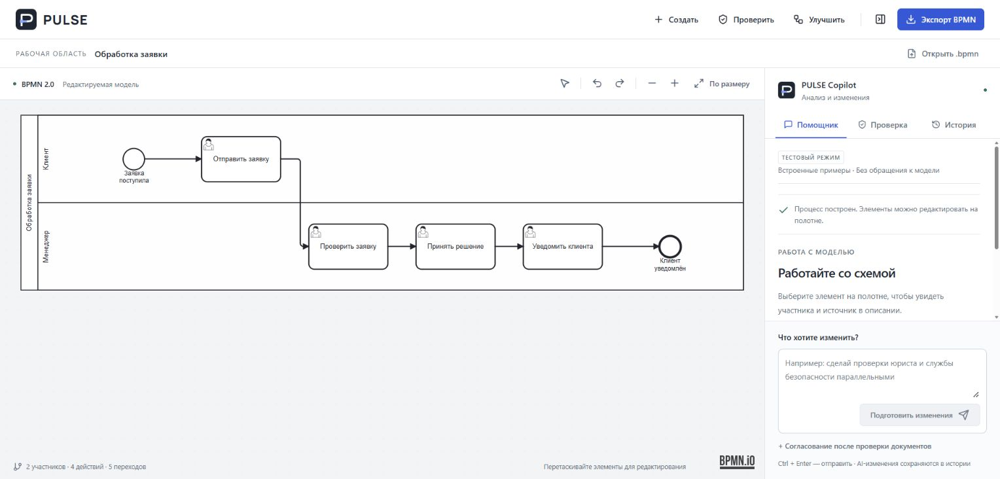
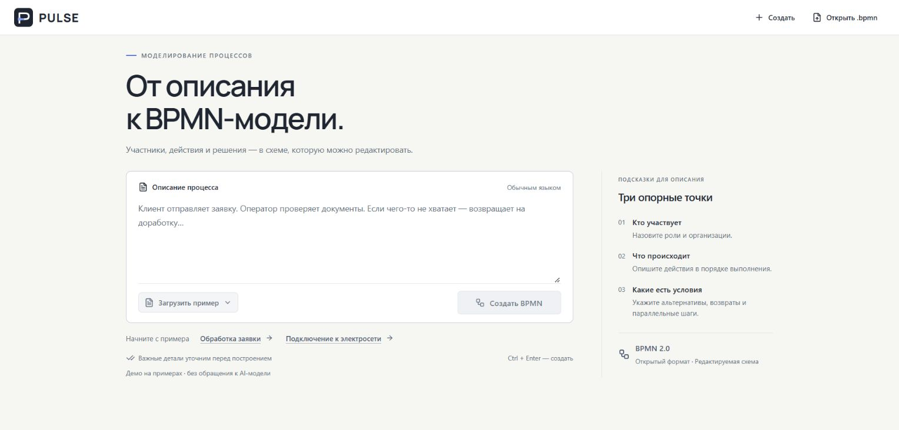
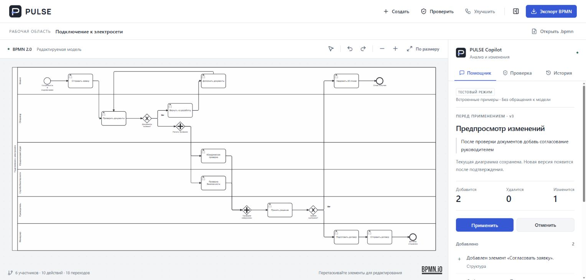
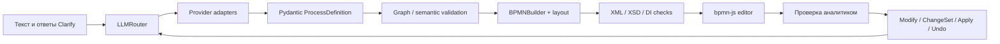

# PULSE — AI Business Process Engineer

PULSE превращает описание бизнес-процесса в редактируемую **BPMN 2.0-модель**: уточняет неоднозначности, проверяет структуру и помогает изменять процесс обычными словами. Аналитик проверяет предложенные изменения перед применением.

[](https://github.com/Dteaher/pulse-ai/actions/workflows/quality.yml)


**Статус:** рабочий прототип для демонстраций и подготовки пилота. Промышленное внедрение и платящие заказчики не заявляются. Результаты автоматических проверок — в [GitHub Actions](https://github.com/Dteaher/pulse-ai/actions).


*Реальный локальный интерфейс. Для воспроизводимого снимка использован mock-провайдер; это не замер качества внешней LLM.*

<details>
<summary>Главный экран и preview изменений</summary>




Все изображения сняты с локального приложения в mock-режиме.
</details>

## Для кого

Для аналитиков и команд, которые переносят текстовые регламенты в схемы, уточняют условия и согласуют изменения. PULSE помогает сократить ручное построение и обнаружить структурные ошибки; измеренного ROI и гарантированного ускорения пока нет.

## Возможности

- Текст → типизированная ProcessDefinition → BPMN XML с диаграммой.
- Clarify: критичные вопросы, уточнения и принятые допущения.
- Modify: предложение изменений, ChangeSet и явное применение.
- История до 20 предыдущих версий текущей вкладки; Undo и предложение TO-BE.
- Doctor: программные проверки; модельный бизнес-аудит, когда доступен.
- Pools/Lanes, Message Flow, поддерживаемые события и шлюзы, циклы.
- Редактор bpmn-js, загрузка и выгрузка `.bpmn`; импорт поддерживаемого subset в AI-слой.

## Как работает



FastAPI и Pydantic обслуживают общий BPMN pipeline; React, TypeScript и Vite — рабочую область. lxml проверяет XML по локальным XSD. Модель не создаёт исполняемый код. [Архитектура](docs/architecture.md).

### Независимость от LLM

Provider abstraction изолирует форматы API. `LLM_PROVIDER`, `LLM_MODEL`, `LLM_BASE_URL`, `LLM_API_KEY` меняют модель без изменения ProcessDefinition, валидатора, сборщика и frontend. Есть OpenAI/OpenAI-compatible, MultiAI, Yandex, Gemini/Vertex Gemini и mock adapters. Наличие adapter не гарантирует доступность любой модели или её качество.

Ответы проходят Pydantic validation и ограниченный corrective retry; timeout, 429/5xx и временные сбои могут переключить запрос на отдельно настроенный fallback. Ключи остаются на backend. [Конфигурация и ограничения](docs/architecture.md#ai-провайдеры).

## Quick Start

Нужны Python 3.12, Node.js 24 и pnpm 11.19.0. Демонстрация работает без платных ключей.

```sh
git clone https://github.com/Dteaher/pulse-ai.git
cd pulse-ai
python -m venv .venv
# Linux/macOS
. .venv/bin/activate
# Windows PowerShell вместо предыдущей строки: .venv\Scripts\Activate.ps1
python -m pip install -r backend/requirements-dev.lock.txt
```

Скопируйте `.env.example` в `.env` (`cp` в Linux/macOS, `Copy-Item` в PowerShell). Оставьте `LLM_PROVIDER=mock` для примеров. Затем в двух терминалах:

```sh
# Корень проекта, активированная .venv
python -m uvicorn app.main:app --app-dir backend --host 127.0.0.1 --port 8002
```

```sh
cd frontend
npm install -g pnpm@11.19.0
pnpm install --frozen-lockfile
pnpm dev
```

Откройте **http://127.0.0.1:5180** и выберите «Обработка заявки». Mock поддерживает предопределённые демонстрационные сценарии, не произвольную генерацию. Для собственных текстов настройте настоящий provider в `.env`. [Демо-сценарии](docs/demo-scenarios.md).

## Проверки

```sh
# В backend после активации .venv
python -m pytest tests -q
# В frontend
pnpm typecheck
pnpm build
pnpm exec playwright install chromium
pnpm test
```

В Windows браузерные тесты используют Edge по умолчанию; для установленного Chromium задайте `PULSE_TEST_CHANNEL=chromium`. CI запускает тесты с mock, без оплачиваемых API. [Результаты и аудит](docs/verification.md).

## Границы продукта

Поддерживается описательный, **неисполняемый** профиль BPMN 2.0.2. XSD-валидность не доказывает правильность бизнес-процесса и не означает поддержку всех конструкций стандарта. [Матрица subset](docs/bpmn-2.0.2-conformance.md). Сложные описания требуют проверки аналитиком.

Версии хранятся в памяти вкладки; серверная история, аккаунты, SSO/RBAC и multi-tenant изоляция не реализованы. Для закрытого демо есть общий код доступа и ограничения операций; это не корпоративная система идентификации. [Готовность к B2B](docs/enterprise-readiness.md).

## Пилот и roadmap

Предлагаем платный пилот: выбрать процесс, согласовать критерии качества и измерить эффект на документах заказчика. Затем — решение о лицензии/подписке и интеграциях. Условия определяются отдельно; подтверждённых контрактов и экономики нет. [Roadmap](docs/roadmap.md), [описание продукта](docs/product-overview.md).

PULSE Industrial — возможная будущая адаптация для инженерных процессов, PFD/P&ID и симуляторов; текущий продукт этих возможностей не реализует. [Industrial](docs/industrial.md).

## Развёртывание и использование

[Docker / HTTPS / доступ к демо](deploy/README.md). Production требует `PULSE_ACCESS_TOKEN`; backend не публикуется напрямую. Не загружайте конфиденциальные документы в демо без согласованного режима обработки данных.

Команда: Никита Тарасюк — разработка и AI; Ирина Чиркова — дизайн и frontend. Контакт по пилоту: **nikitka.football@bk.ru**.

Лицензия на исходный код пока не выбрана; коммерческие условия согласуются с командой. MIT/Apache/GPL проекту не назначены. Сторонние зависимости распространяются по собственным лицензиям. Исторические материалы сохранены в [docs/history](docs/history/hackathon-readme.md).
