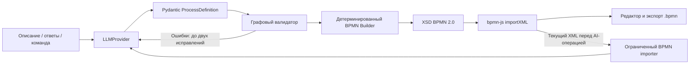

# PULSE — AI Business Process Engineer

Рабочий веб-прототип для полуфинала «ИИ-ассистенты для энергетики». Переводит описание процесса в проверяемую BPMN 2.0 модель, задаёт важные уточнения и позволяет изменять схему обычным языком.

## Возможности

- Текст → строгий Process JSON → программная проверка → BPMN XML с координатами → редактор bpmn-js.
- Участники в дорожках общего пула; задачи, условия, исключающие, параллельные и включающие шлюзы, возвраты, несколько завершений.
- До четырёх вопросов за итерацию. При критичных неопределённостях схема не публикуется до ответа.
- Ручное редактирование, масштаб, Undo/Redo, импорт `.bpmn`, экспорт текущего полотна.
- Изменение естественным языком; до 20 предыдущих версий в памяти сессии.
- BPMN Doctor: XSD, графовые проверки и бизнес-правила; с реальной моделью также LLM-аудит. Замечания подсвечивают элементы.
- Источник узла и категориальное подтверждение. Категории не являются измеренной вероятностью корректности.
- Предложение TO-BE с перечнем изменений и подтверждением применения. AS-IS доступен в истории.
- Три встроенных примера и честно обозначенный mock-режим без вызовов модели.

## Архитектура



LLM не генерирует XML и не выполняет код. Промпты находятся в `backend/app/prompts`. Сборщик использует lxml, отдельный layout слева направо и стандартные BPMN DI. API-ключи только на backend. Входные описания передаются модели как недоверенные данные. XML parser запрещает DTD и внешние сущности.

Стек: React, TypeScript, Vite, bpmn-js, CSS; Python 3.11+, FastAPI, Pydantic 2, httpx, lxml, pytest. База данных и авторизация для локального MVP не требуются.

## LLM-архитектура

Текущая конфигурация: **Groq / `openai/gpt-oss-120b` → при сбое Vertex Gemini / `gemini-2.5-flash` → ProcessDefinition → Validator → BPMNBuilder**. Бизнес-логика не импортирует SDK и конкретные адаптеры. `GroqProvider` использует совместимый API, `VertexGeminiProvider` — официальный `google-genai` (зафиксированная версия 2.28.0), `genai.Client(vertexai=True, api_key=...)`, Vertex Express Google Cloud. Google AI Studio для этого резерва не используется. Endpoint и Express-режим выбирает SDK; дополнительный Google project/location для выбранного режима не требуются. Нужен Google Cloud API key с доступом к Vertex Express. Доступность модели и права ключа проверяются реальным запросом.

```dotenv
# PRIMARY — GROQ
PRIMARY_LLM_PROVIDER=groq
PRIMARY_LLM_BASE_URL=https://api.groq.com/openai/v1
PRIMARY_LLM_MODEL=openai/gpt-oss-120b
PRIMARY_LLM_API_KEY=

# FALLBACK — GOOGLE CLOUD / VERTEX EXPRESS
FALLBACK_LLM_PROVIDER=vertex_gemini
FALLBACK_LLM_MODEL=gemini-2.5-flash
FALLBACK_LLM_API_KEY=

# FAILOVER
LLM_FALLBACK_ENABLED=true
LLM_MAX_RETRIES=2
LLM_TIMEOUT=90
LLM_MAX_TOKENS=8000
```

`PRIMARY_LLM_MODEL`, `PRIMARY_LLM_BASE_URL`, `PRIMARY_LLM_API_KEY` имеют приоритет над прежними `LLM_*`. Прежние настройки совместимых API сохранены. `vertex-gemini` также принимается как алиас `vertex_gemini`. `LLM_FALLBACK_ENABLED=false` выключает резерв. `LLM_MAX_RETRIES` задаёт число corrective retry на одном провайдере: 2 означает первоначальный запрос + до двух исправлений. HTTP 401, 429, timeout, network error, 5xx и временная недоступность модели запускают резерв; ошибки JSON сначала исправляются на том же провайдере. Второй переход и бесконечные retry не выполняются.

Промпты общие в `backend/app/prompts`: extraction, clarification, modification, audit. JSON внутри Markdown или пояснений извлекается внутри адаптера только при наличии одного JSON-объекта; затем обязательна исходная Pydantic-валидация. Vertex получает поддерживаемую проекцию схемы; ограничения исходной модели проверяются после ответа. `LLMRouter` ведёт изолированное состояние одной операции. Metadata возвращает `provider_used`, `model_used`, `fallback_used`, `attempts` (число обращений к AI, включая JSON-исправления и переключение). Верхнее поле `attempts` генерации по-прежнему описывает итерации графового pipeline.

`GET /api/llm/info` не вызывает модели:

```json
{
  "primary": {"provider": "groq", "model": "openai/gpt-oss-120b"},
  "fallback": {"enabled": true, "provider": "vertex_gemini", "model": "gemini-2.5-flash"}
}
```

Ключи остаются только в `.env`, файл исключён из Git. Чтобы сменить модель, измените `.env`; существующие API процесса, JSON, экспорт BPMN и bpmn-js не меняются. Проверено с реальными ключами: Groq `openai/gpt-oss-120b` и отдельно Vertex `gemini-2.5-flash` вернули валидные процессы и BPMN. Сквозная генерация через frontend на Groq получила HTTP 200 и отобразилась в bpmn-js без ошибок; metadata attempts=1. Автоматический failover и ошибки 401/429/5xx, timeout, network, invalid JSON проверены через mock HTTP/SDK, без намеренного сбоя реального API. Три UI-теста статуса primary/fallback и контролируемой ошибки после этой доработки также прошли без AI-запросов. Результаты unit-тестов не заменяют проверку реального доступа.

## Независимость от LLM

PULSE использует Adapter / Provider: основные маршруты и BPMN pipeline знают только `LLMProvider`. Конкретные подключения создаёт `get_llm_provider()` в `backend/app/services/llm/factory.py`. HTTP-запросы, авторизация, формат сообщений и обработка внешнего ответа находятся внутри адаптеров. Process JSON не зависит от модели.

Структура AI-слоя:

```text
backend/app/services/llm/
    base.py                       # LLMProvider, LLMMessage, ProviderError
    factory.py                    # выбор провайдера по .env
    openai_provider.py
    openai_compatible_provider.py
    yandex_provider.py
    mock_provider.py
    router.py                     # LLMRouter, failover и metadata
```

Все адаптеры возвращают общие Pydantic-модели: `parse_process` → `ProcessDefinition`, `clarify_process` → `ClarificationResult`, `modify_process` → `ModificationResult`, `audit_process` → `AuditResult`. У результатов уточнения и изменения поле `process` содержит `ProcessDefinition`. Существующий внешний контракт API и frontend сохранён.

Чтобы перейти между OpenAI-compatible API (в том числе сервисами с gpt-oss-120b), OpenAI и моделями Яндекса, достаточно изменить в корневом `.env`:

```dotenv
LLM_PROVIDER=openai_compatible
LLM_MODEL=nvidia/nemotron-3-super-120b-a12b:free
LLM_BASE_URL=https://openrouter.ai/api/v1
LLM_API_KEY=ваш_ключ
```

Это пример конфигурации, а не гарантия доступности модели или бесплатных лимитов. Для Яндекса замените эти же четыре значения:

```dotenv
LLM_PROVIDER=yandex
LLM_MODEL=gpt://<folder_ID>/<model_name>
LLM_BASE_URL=https://ai.api.cloud.yandex.net/v1
LLM_API_KEY=секрет_ключа_Яндекса
```

Из полного URI адаптер извлекает ID каталога. При коротком имени модели нужен дополнительный `YANDEX_FOLDER_ID`. Основные `ProcessDefinition`, валидатор, BPMN Builder, Doctor, frontend и существующие endpoints не меняются. Для API с принципиально другим протоколом добавляется адаптер и запись factory, без переработки бизнес-логики.

**Structured Outputs и исправление ответа.** В auto-режиме (параметр `LLM_STRUCTURED_OUTPUT` не задан) совместимые адаптеры пробуют JSON Schema; только при явной ошибке неподдерживаемого формата переходят на JSON mode, затем на JSON по инструкции без `response_format`. `true` принудительно включает JSON Schema, `false` — JSON mode. OpenAI по умолчанию использует строгий JSON Schema. Схема всегда есть в промпте, каждый ответ проходит Pydantic. Некорректный JSON не выходит из адаптера: выполняются до двух corrective retry. Аудит проверяется так же. Затем общий pipeline проверяет граф и при необходимости делает до двух исправлений семантической структуры. Это разные проверки, суммарно они могут потребовать несколько оплачиваемых вызовов. Поддержка JSON не гарантирует сохранения бизнес-смысла.

**Необязательный fallback.** Обычно достаточно `LLM_PROVIDER`. Дополнительно можно задать `PRIMARY_LLM_PROVIDER` (имеет приоритет) и отдельные настройки резерва:

```dotenv
PRIMARY_LLM_PROVIDER=openai_compatible
FALLBACK_LLM_PROVIDER=yandex
FALLBACK_LLM_MODEL=gpt://<folder_ID>/<model_name>
FALLBACK_LLM_BASE_URL=https://ai.api.cloud.yandex.net/v1
FALLBACK_LLM_API_KEY=секрет_резервного_ключа
```

Без `FALLBACK_LLM_PROVIDER` резерв не создаётся. Переход выполняется при timeout, сетевой ошибке, HTTP 429/5xx, временной недоступности модели/API или исчерпании исправлений некорректного JSON. HTTP 401 допускает один переход в настроенный резерв без повторных запросов с неверным ключом. HTTP 403, отказ модели и неправильные настройки не маскируются. Mock не может быть резервом реальной модели. Переключение записывается в серверный журнал без ключей и исходного текста; резерв сохраняется на оставшиеся попытки текущего запроса. Новый запрос снова начинает с primary. Резерв также должен быть настроен и может тарифицироваться.

**Автоматический failover.** `LLMRouter` работает поверх `LLMProvider`. Для каждой HTTP-операции создаётся отдельный router: запрос начинается с primary, резерв сохраняется на оставшиеся попытки этой операции. Невалидный JSON или Pydantic-модель сначала исправляются на том же провайдере (до двух corrective retry); только после исчерпания попыток разрешён резерв. Поддерживаются timeout, network error, HTTP 429, 500/502/503/504 и явные временные ошибки доступности модели/API. HTTP 401 допускает переход в резерв; HTTP 403 и постоянные ошибки настройки не запускают failover. Если оба подключения не дали результат, API возвращает безопасную ошибку 502; текущая диаграмма не заменяется.

В успешных ответах `/api/process/generate`, `/clarify`, `/modify` добавлено поле `metadata`:

```json
{
  "provider_used": "openai_compatible",
  "model_used": "nvidia/nemotron-3-super-120b-a12b:free",
  "fallback_used": false,
  "attempts": 1
}
```

При переключении поля относятся к резервному провайдеру и `fallback_used=true`. Аудит также возвращает metadata при успешном LLM-аудите, иначе null. Ключи, адрес API и исходные ошибки провайдера в metadata не входят. В UI показывается модель последнего AI-ответа или «Резервная модель активирована». `/api/llm/info` по-прежнему сообщает конфигурацию primary, а не результат последней операции. Тесты failover выполняются с подменой HTTP-транспорта; резерв не настроен автоматически без выданных для него реквизитов.

**Обновление настроек.** `.env` читается перед новым AI-запросом без перезапуска сервера. Каждый запрос получает отдельный snapshot подключения, поэтому изменение файла не меняет модель посреди операции. Переменные окружения процесса не используются для этих настроек. API-ключи остаются на сервере, `.env` исключён из Git. `GET /api/llm/info` возвращает конфигурацию primary и fallback без ключей и не обращается к модели.

**Доказательство независимости.** `test_llm_independence.py` проверяет одинаковый `ProcessDefinition` и одинаковый XSD-валидный BPMN XML через Mock, OpenAI-compatible и Yandex с подменой HTTP-транспорта. Проверены типы четырёх операций, исправление JSON, согласование формата, политика fallback, безопасный info и отсутствие импортов конкретных адаптеров в бизнес-модулях. Реальное качество каждой подключаемой модели нужно оценивать отдельно.

## Установка и запуск

Нужны Python 3.11+ и Node.js 20.19+ / 22.12+ с npm (или pnpm). Команды выполняются из корня проекта.

### Backend

```powershell
python -m venv .venv
.\.venv\Scripts\python.exe -m pip install -r backend/requirements.lock.txt
Copy-Item .env.example .env
```

Для Linux/macOS: `python3 -m venv .venv`, затем `.venv/bin/pip install -r backend/requirements.lock.txt`; копирование: `cp .env.example .env`.

Измените `.env` в корне проекта, затем запустите:

```powershell
cd backend
..\.venv\Scripts\python.exe -m uvicorn app.main:app --host 127.0.0.1 --port 8000 --reload
```

Linux/macOS: `cd backend && ../.venv/bin/python -m uvicorn app.main:app --host 127.0.0.1 --port 8000 --reload`.

### Frontend — в отдельном терминале

```sh
cd frontend
npm install
npm run dev
```

Альтернатива с зафиксированным `pnpm-lock.yaml`: `pnpm install --frozen-lockfile`, `pnpm dev` (pnpm 11).

Откройте [PULSE](http://127.0.0.1:5173). Vite перенаправляет `/api` на backend; ключи в frontend не передаются. API-документация: [Swagger](http://127.0.0.1:8000/docs).

### OpenAI

```dotenv
LLM_PROVIDER=openai
LLM_API_KEY=ваш_ключ
LLM_MODEL=идентификатор_доступной_модели
LLM_BASE_URL=https://api.openai.com/v1
```

Выберите доступную аккаунту модель с Structured Outputs и мощностью, соответствующей правилам хакатона. Модель намеренно не зашита в код. Используется `/v1/chat/completions` с `response_format=json_schema`, `strict=true`. Ошибки доступа, отказ модели, timeout и исчерпание лимита имеют понятные сообщения. Без явной настройки fallback другая модель не вызывается.

### gpt-oss-120b / другой OpenAI-compatible API

```dotenv
LLM_PROVIDER=openai_compatible
LLM_API_KEY=ваш_ключ
LLM_BASE_URL=https://openrouter.ai/api/v1
LLM_MODEL=nvidia/nemotron-3-super-120b-a12b:free
```

Адрес и идентификатор модели возьмите у выбранного провайдера. Если endpoint поддерживает только JSON mode, явно задайте `LLM_STRUCTURED_OUTPUT=false`: схема остаётся в промпте, Pydantic и программные проверки остаются обязательными. Поддержка конкретного API требует проверки с его ключом.

### Yandex

Адаптер `YandexProvider` поддерживает `/chat/completions` AI Studio. Задайте `LLM_PROVIDER=yandex`, `LLM_BASE_URL=https://ai.api.cloud.yandex.net/v1`, `LLM_API_KEY`, `YANDEX_FOLDER_ID` и `LLM_MODEL=gpt://<folder_ID>/<model_name>`. Отправляются `Authorization: Api-Key` и `OpenAI-Project`, согласно [официальной документации Yandex AI Studio](https://aistudio.yandex.ru/en/docs/ai-studio/operations/generation/completions-basic). Выберите модель своего аккаунта и проверьте её поддержку JSON Schema; при необходимости явно задайте `LLM_STRUCTURED_OUTPUT=false`. Нативный API с иным протоколом потребует отдельной реализации `LLMProvider`; основной pipeline не меняется. Контракт транспорта проверен без сети, реальный endpoint пока не проверен.

### Без ключа: тестовый режим

```dotenv
LLM_PROVIDER=mock
```

Сохраните `.env`: следующий AI-запрос использует новые настройки без перезапуска. Mock распознаёт **только точные тексты трёх встроенных примеров**. Произвольный текст отклоняется, а не подменяется чужим процессом. Он поддерживает обе комбинации ответов на два вопроса и команду:

> После проверки документов добавь согласование руководителем

Другие AI-команды, свободные уточнения, TO-BE и LLM-аудит требуют реальной модели. Основной MVP можно проверить без платного API, но для показа реального понимания произвольного текста на хакатоне подключите модель.

## Демонстрация

### Подключение выбранной Qwen3.6 через Яндекс

Для Qwen задайте в `.env` `LLM_PROVIDER=yandex` и `LLM_MODEL=qwen3.6-35b-a3b`, а также `LLM_BASE_URL=https://ai.api.cloud.yandex.net/v1`. Заполните **`LLM_API_KEY`** (секретный ключ, не его ID) и **`YANDEX_FOLDER_ID`**. Полный URI модели собирается автоматически; также можно указать готовый `gpt://<folder_ID>/qwen3.6-35b-a3b`.

Получение ключа: [инструкция Yandex AI Studio](https://aistudio.yandex.ru/ru/docs/ai-studio/operations/get-api-key). Для простого варианта откройте [AI Studio](https://aistudio.yandex.cloud/), выберите каталог, нажмите «Создать API-ключ», выберите срок действия и сохраните секрет. ID каталога можно скопировать из переключателя каталогов. `.env` исключён из Git; ключ не нужно отправлять в чат.

Проверка настроек **без API-запроса**, из папки `backend`:

```powershell
..\.venv\Scripts\python.exe evaluate.py --check-config
```

После заполнения сохраните `.env`: настройки подхватятся в следующем запросе. Настройки подключения читаются только из корневого `.env`; переменные окружения процесса не перекрывают файл. Уже выполняющийся запрос сохраняет выбранное подключение на все попытки исправления.

Один пробный запрос к реальной модели (платный API):

```powershell
..\.venv\Scripts\python.exe evaluate.py --case connection
```

Затем все 15 процессов: `..\.venv\Scripts\python.exe evaluate.py`. Описания и ожидания находятся в `examples/evaluation-cases.json`; результаты, измеренные задержки, число попыток, JSON и BPMN сохраняются в `.runtime/evaluations/<дата>/`. При первой ошибке выполнение прекращается, чтобы не расходовать запросы на неисправную конфигурацию. Структурные проверки не доказывают сохранение бизнес-смысла: в каждом кейсе есть список пунктов для ручного просмотра. До получения ключа результаты реальной Qwen отсутствуют.

### Показ прототипа

1. «Загрузить пример» → «Подключение к электросети» → «Создать BPMN».
2. На схеме: шесть участников, возврат на проверку документов, условные ветки, параллельные проверки и объединение.
3. Выберите задачу, проверьте источник. Перетащите элемент; «Инструменты BPMN» открывают палитру.
4. В Copilot отправьте команду из примера выше. Новая задача появляется, предыдущая версия доступна в «Истории».
5. «Проверить»: XML/XSD, связи, события, участники, шлюзы. Нажмите рекомендацию, чтобы подсветить узлы.
6. «Экспорт BPMN» сохраняет **текущий XML редактора**, включая ручные изменения. Откройте файл на [demo.bpmn.io](https://demo.bpmn.io), подвигайте элементы и сохраните его.
7. «Создать» → пример с неоднозначностями → ответьте на вопросы о параллельности и отказе → постройте диаграмму.

Материалы: `examples/*.txt`, `*.json`, `*.bpmn`. В `examples/03-ambiguous.json` хранится предварительная модель; `.bpmn` намеренно отсутствует до ответов. Краткий сценарий видео — `examples/demo-script.md`.

## Проверки

```powershell
cd backend
..\.venv\Scripts\python.exe -m pytest tests -q
```

```sh
cd frontend
npm run build
npm test
```

Frontend browser-тесты по умолчанию используют установленный Microsoft Edge. Для Chromium: `npx playwright install chromium`, затем `PULSE_TEST_CHANNEL=chromium npm test` (PowerShell: `$env:PULSE_TEST_CHANNEL='chromium'; npm test`). Они требуют запущенных backend с `LLM_PROVIDER=mock` и frontend. Backend-тесты не требуют ключей: модели, плохие ссылки, дубликаты, события, шлюзы, XSD, roundtrip, уточнения, bounded retries и ошибки провайдера. Интеграционные тесты транспорта LLM используют httpx mock, не платный API.

## API

| Метод | Endpoint | Назначение |
|---|---|---|
| GET | `/api/health` | Провайдер и наличие настроек |
| GET | `/api/llm/info` | Primary и fallback: провайдер, модель и enabled; без ключей |
| GET | `/api/examples` | Три описания |
| POST | `/api/process/generate` | `{text}` → процесс, вопросы, XML или null |
| POST | `/api/process/clarify` | `{process, answers}` → уточнённая модель |
| POST | `/api/process/modify` | `{process, command}` → новая модель |
| POST | `/api/process/bpmn` | `{process}` → проверенный XML |
| POST | `/api/process/import` | `{xml, previous?}` → актуальный Process JSON |
| POST | `/api/process/audit` | `{xml, previous?}` → технические и бизнес-проверки |

## Ограничения MVP

Проверено при разработке: **104 backend-теста**, **11 браузерных тестов**, TypeScript и production-сборка Vite. Выполнен ручной импорт экспорта PULSE в официальный `demo.bpmn.io` и переименование задачи там. Проверены экраны 1366×768 и 1920×1080. Выполнены реальные запросы OpenRouter к `nvidia/nemotron-3-super-120b-a12b:free`: HTTP 200, Pydantic, граф, XSD и отображение результата в bpmn-js проверены на процессе ремонта электросчётчика. Повторная генерация через сайт также успешна. Это проверка подключения и одного сквозного сценария, а не оценка качества на всех 15 кейсах. TO-BE интерфейс проверен с подменой транспорта, качество рекомендаций модели ещё требует проверки. Примеры и экспорт проходят локальные XSD OMG.

- Реальные LLM-вызовы требуют API-ключа и доступной модели. Отдельно протестируйте качество выбранной модели на энергетических процессах перед демонстрацией.
- Размер ответа регулируется `LLM_MAX_TOKENS` (по умолчанию 16000). При обрезанном ответе выводится понятное сообщение; лимит нужно согласовать с возможностями выбранной модели.
- Генерация: один процесс с дорожками общего пула. Взаимодействие автономных пулов через message flow, вложенные подпроцессы и исполняемые интеграции не генерируются.
- Импорт сложного BPMN доступен для ручного редактирования и экспорта. AI-операции отклоняются при неподдерживаемых элементах, чтобы не терять их при перестроении.
- Графовая и XSD-валидация не доказывают полную корректность токеновой семантики, взаимоисключаемость текстовых условий и отсутствие deadlock сложных parallel/inclusive моделей. Это честно отмечено в аудите.
- Layout рассчитан на небольшие процессы до 150 узлов, возможны пересечения длинных связей. Большие диаграммы требуют масштабирования и ручной компоновки.
- При AI-перестроении координаты рассчитываются заново; семантика ручных изменений синхронизируется перед запросом. Экспорт сохраняет текущую компоновку.
- Evidence — выдержки и интерпретации модели, а не независимая проверка фактов. Ручные изменения требуют повторного подтверждения.
- История хранится в памяти текущей вкладки; после перезагрузки исчезает. Скачайте BPMN перед закрытием.
- Симуляция токенов не реализована (P3). TO-BE — предложение с изменениями, без придуманного выигрыша во времени/стоимости.
- Приложение предназначено для локального запуска, без пользователей, RBAC и квот. Публичное размещение требует отдельных мер защиты API.

## Источники

- [BPMN 2.0.2 и официальные XML-схемы OMG](https://www.omg.org/spec/BPMN/machine-readable) — локальная копия пяти XSD в `backend/app/schemas`.
- [bpmn-js walkthrough](https://bpmn.io/toolkit/bpmn-js/walkthrough/) — импорт, моделирование и экспорт.
- [OpenAI Structured Outputs](https://developers.openai.com/api/docs/guides/structured-outputs) — строгий JSON Schema контракт.
